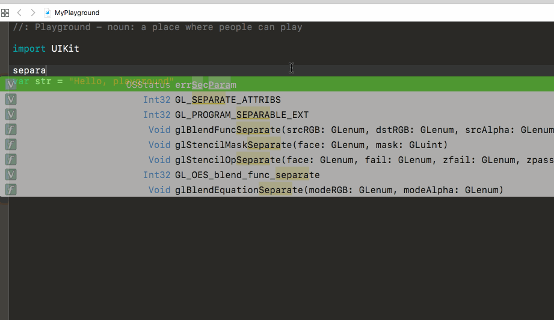

# XcodeExtension

This project is just an example of an Xcode Extension.

Contains 3 commands:

* Convert selection to uppercase
* Convert selection lowecase
* Convert selection to a old-fashion-ascii-separator 🤦‍♂

